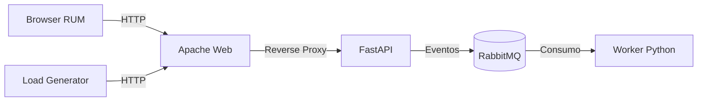

# Appoena Observability Demo

Projeto de demonstração criado para ilustrar um fluxo completo de observabilidade em uma arquitetura Event-Driven utilizando as ferramentas do Datadog.



O projeto conta com uma API que gerencia um CRUD de itens, publica as ações em uma fila de mensagens e um worker em background que consome e processa esses dados.
Toda a comunicação e execução já está configurada para gerar telemetria.

<details>
<summary><strong>Entendendo a Arquitetura</strong></summary>

O ambiente roda inteiramente contêinerizado e é composto por:
- **Frontend (Apache)**: Web-Server provendo os arquivos estáticos, integrado com Datadog RUM.
- **Backend API (FastAPI)**: Responsável por receber o tráfego HTTP e publicar as mudanças de estado na fila.
- **RabbitMQ**: O broker de mensagens que interliga a API e o worker.
- **Worker (Python)**: Consumidor que fica escutando a fila para processar os eventos assincronamente.
- **Loadgen**: Um gerador de carga automatizado para simular uso da plataforma e popular os gráficos com dados.
- **Datadog Agent**: O agente encarregado de capturar logs, traces e métricas de toda a stack.
</details>

<details>
<summary><strong>Subindo o ambiente localmente</strong></summary>

Antes de começar, garanta que você tenha o Docker instalado e suas credenciais do Datadog em mãos.

1. Duplique o arquivo `.env.example` renomeando-o para `.env`.
2. Edite o `.env` inserindo sua API Key do Datadog e as variáveis do RUM.
3. Inicie os serviços rodando:
   ```bash
   docker compose up -d --build
   ```
4. A interface ficará disponível em `http://localhost:8080`.
</details>

<details>
<summary><strong>Destaques de Observabilidade</strong></summary>

- **RUM**: O Datadog RUM está parametrizado com o `allowedTracingUrls`, permitindo monitorar a experiência do usuário correlacionando com os traces.
- **APM**: É possível acompanhar o ciclo de vida da requisição por completo.
- **Logs**: A maior parte da stack gera logs em JSON que são injetados com o trace_id e span_id, correlacionando os traces de ponta a ponta.
</details>

<details>
<summary><strong>Provisionando Recursos com Terraform</strong></summary>

O projeto inclui configurações do Terraform na pasta `datadog/` para criar painéis e monitores diretamente na sua conta.

1. Navegue até o diretório:
   ```bash
   cd datadog/
   ```
2. Crie o arquivo de variáveis a partir do template:
   ```bash
   cp terraform.tfvars.example terraform.tfvars
   ```
3. Preencha o arquivo `terraform.tfvars` com suas credenciais de API Key e APP Key do Datadog.
4. Inicialize e aplique a infraestrutura:
   ```bash
   terraform init
   terraform apply
   ```
</details>